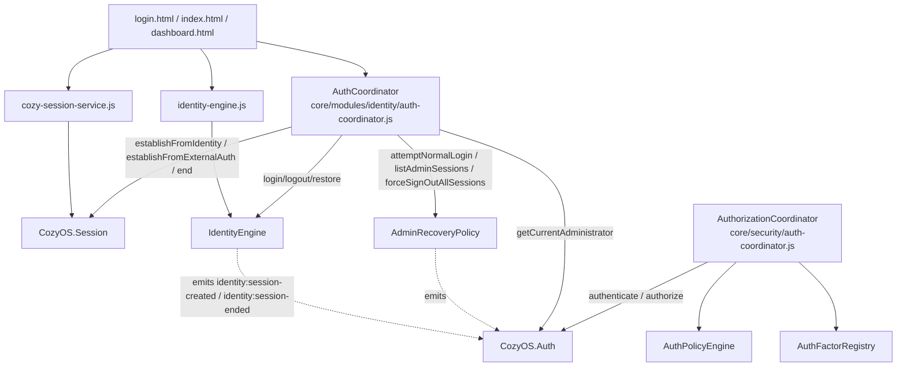
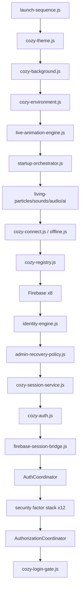
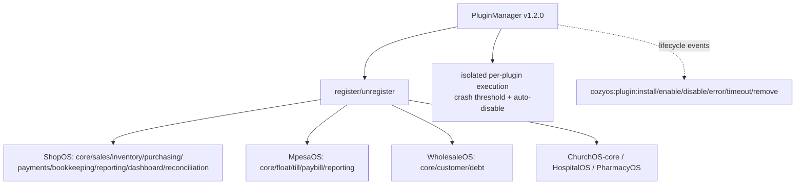
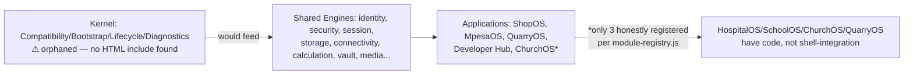

# CozyOS — Architecture Graphs (Living Artifact)
Generated by Cozy Builder Observation Engine · Source: direct inspection of `dashboard.html`/`login.html`/`index.html` script order + coordinator source files. Every edge below was confirmed by reading a `#identity()`/`#session()`-style accessor, a `<script src>` tag, or an explicit "calls X" comment — none are guessed from naming alone.

## 1. Authentication & Session Dependency Graph

**M372 fix, shown structurally:** before M372, `login.html`/`index.html` had `ac` wired but not `css`→`sess` — so `ac`'s calls into `sess` during `restoreSession()` hit a null dependency. The missing edge is now present on all three pages (verified).

## 2. Startup / Module-Loading Graph (dashboard.html, first 20 of 80+ script tags, in load order)

## 3. Plugin Graph

## 4. Module Graph (layer level, matches CORE_ARCHITECTURE.md's own stated layering)

## 5. Event Graph
See `04-event-catalog.md` for the full extracted list. Structurally, events flow: **engine emits → `platform-event-bus.js` (or native `CustomEvent`) → listeners in coordinator/UI layers**, never engine-to-engine direct calls for cross-cutting concerns (this pattern held in every coordinator file read).
